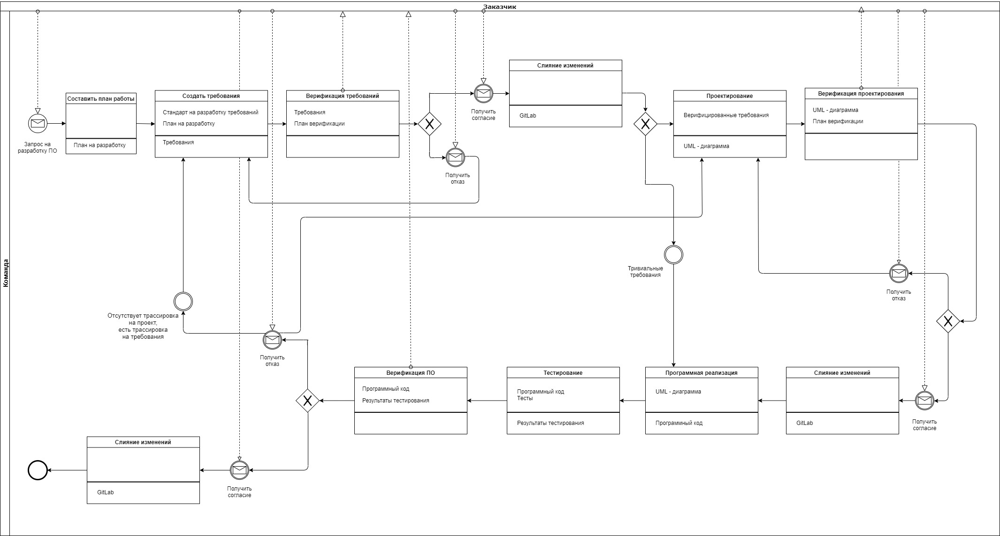

# Жизненный цикл

Ниже представлена _BPMN_ схема жизненного цикла.

При создании схемы использовались следующие элементы:

- Прямоугольники с тремя отсеками (действия с необходимыми артефактами):
    - Сверху обозначено название действия.
    - По середине - артефакты, требующиеся для выполнения действия.
    - Внизу - артефакты, являющиеся результатом выполнения действия.
-  - это промежуточные события-сообщения (_message events_), показывающие получение и отправку сообщений в ходе выполнения процесса.
-  - это промежуточные простые события (_plain events_) использующиеся, чаще всего, для того, чтобы показать начало или окончание процесса.
-  - это оператор исключающего «или», управляемый данными (_data-based exclusive gateway_).
-  - это поток управления, задающий порядок выполнения действий.
-  - это поток сообщений, показывающий, какими сообщениями обмениваются участники.

## Разработка требований

Цели процесса:

* Разработка требований к ПО высокого уровня;
* Разработка производных требований к ПО высокого уровня.

Условия входа в процесс (необходимо одно из представленных):

* Запрос на изменение требований к ПО назначен ответственному разработчику. При этом установлены базовые версии всех входных данных процесса разработки требований к ПО.
* В результате формальной инспекции запроса на изменение требований к ПО обнаружены несоответствия.

Описание процесса:

1. При входе в процесс ответственный разработчик должен перевести запрос на изменение в соответствующее состояние, тем самым извещая руководителя проекта о начале работы.
2. На основании анализа описания запроса на изменение или записи о формальной инспекции в соответствии со стандартом на разработку требований к ПО разработчик определяет те документы требований к ПО, которые необходимо изменить, создать или удалить.
3. Если в процессе разработки требований обнаружены несоответствия во входных данных процесса, то ответственный разработчик должен создать сообщение о проблеме.
4. Для всех требований к ПО, не являющихся производными, необходимо установить трассировочные связи с соответствующими им требованиями к системе.
5. После завершения работы над требованиями и помещения результатов в систему поддержки разработки ответственный разработчик должен известить об этом руководителя проекта.

Условия выхода из процесса:

* Все найденные во входных данных несоответствия зарегистрированы в сообщениях о проблемах.
* Работы, начатые по запросу на изменение или по результатам формальной инспекции, завершены и измененные требования к ПО помещены в систему поддержки разработки.
* Руководитель проекта извещен о завершении работ.

## Проектирование

Цели процесса:

* Определение архитектуры ПО;
* Разработка требований к ПО низкого уровня;
* Разработка производных требования к ПО низкого уровня. 

Условия входа в процесс (необходимо одно из представленных):

* Запрос на изменение описания проекта ПО назначен ответственному разработчику. При этом установлены базовые версии всех входных данных процесса проектирования ПО.
* В результате формальной инспекции запроса на изменение описания проекта ПО обнаружены несоответствия.

Описание процесса разработки:

Процесс с процедурной точки зрения выполняется аналогично с процессом **разработки требований к ПО**, за исключением того, что разработчик руководствуется стандартом на проектирование ПО и использует соответствующие входные данные. Кроме того, трассировочные связи устанавливаются между требованиями к ПО низкого уровня, не являющимися производными, и требованиями к ПО (высокого уровня). 

Условия выхода из процесса:

* Все найденные во входных данных несоответствия зарегистрированы в сообщениях о проблемах.
* Работы, начатые по запросу на изменение или по результатам формальной инспекции, завершены и измененное описание проекта ПО помещено в систему поддержки разработки.
* Руководитель проекта извещен о завершении работ.

## Кодирование

Цели процесса:

* разработать исходный код трассируемый, верифицируемый, непротиворечивый и правильно реализующий требования к ПО низкого уровня.

Условия входа в процесс (необходимо одно из представленных):

* Запрос на изменение исходного кода ПО назначен ответственному разработчику. При этом установлены базовые версии всех входных данных процесса кодирования.
* В результате формальной инспекции запроса на изменение исходного кода ПО обнаружены несоответствия. 

Описание процесса:

Процесс с процедурной точки зрения выполняется аналогично с процессом **разработки требований к ПО**, но есть следующие отличия:

* Разработчик руководствуется стандартом на кодирование ПО и использует соответствующие входные данные.
* При выполнении мероприятий ответственный разработчик использует инструментарий процесса кодирования.

Условия выхода из процесса:

* Все найденные во входных данных несоответствия зарегистрированы в сообщениях о проблемах.
* Работы, начатые по запросу на изменение или по результатам формальной инспекции, завершены и измененный исходный код ПО и командные файлы для сборки кода помещены помещены в систему поддержки разработки.
* Руководитель проекта извещен о завершении работ.
