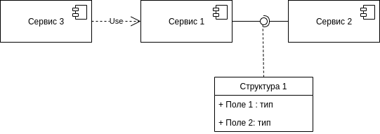
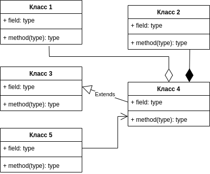
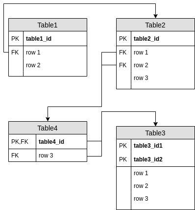
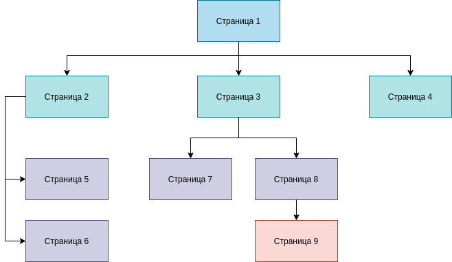
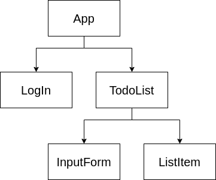

## Стандарт на проектирование  

### Представление результатов проектирования  

* **DesignStandard.SpecificationСontent**: 
    Описание проекта ПО должно состоять из следующих разделов:
    
    - раздел, содержащий общую информацию (цель документа, область применения документа, глоссарий);
    - раздел, содержащий описание архитектуры ПО;
    - один или несколько разделов, содержащих описание проекта одного или нескольких компонентов ПО;
    - раздел, содержащий описание пользовательских интерфейсов ПО;
    - раздел, содержащий описание проекта базы данных; 

    <end>

* **DesignStandard.ArchitectureDescriptionTemplate**:
    Описание архитектуры серверной части ПО должно соответствовать шаблону, описанному в разделе [*Диаграмма компонентов*](#диаграмма-компонентов).
    <end>

* **DesignStandard.ComponentDescriptionTemplate**:
    Описание проектов компонентов серверной части ПО должны быть представлены в виде диаграммы классов (в соответствии с описанием в разделе [*Диаграмма классов*](#диаграмма-классов)), а также для каждого класса, изображённого на диаграмме должно быть приведено описание в соответствии с разделом [*Описание класса*](#описание-класса). Для каждого компонента должно быть приведено API для взаимодействия с ним, оформленное в соответствии с разделом [API сервиса](#api-сервиса).
    <end>

* **DesignStandard.DatabaseDescriptionTemplate**:
    Описание базы данных должно содержать схему базы данных и описание всех таблиц в ней. Схема базы данных должна быть оформлена в соответствии с разделом [Схема базы данных](#схема-базы-данных), а описание таблиц должно соответствовать разделу [Описание таблиц базы данных](#описание-таблиц-базы-данных).
    <end>

* **DesignStandard.InterfaceDescriptionTemplate**: 
    Описание архитектуры клиентской части ПО и описания проектов компонентов клиентской части ПО должно соответствовать шаблону, приведенному в приложении 1. 
    <end>

* **DesignStandard.DiagramTool**: 
    Рисунки, поясняющие описание архитектуры и требования низкого уровня, должны выполняться средствами draw.io.
    <end>

* **DesignStandard.InterfaceMockupTool**: 
    Макеты страниц должны выполняться средствами figma.
    <end>

### Способ идентификации конкретного артефакта проектирования

Каждый артефакт проектирования состоит из заголовка и описания:

1. Заголовок состоит из символа ненумерованного списка и идентификатора. Идентификатор состоит из нескольких частей, разделенных точкой. Все части, кроме последней, задают пространство имён, соответствующее требованию. Последняя часть кратко обозначает объект, описываемый разрабатываемым артефактом проектирования. Идентификаторы записываются на английском языке в PascalCase и выделяются **bold**-шрифтом. 
1. Описание требования должно быть в одном абзаце с идентификатором и завершаться записью `<end>`. Допускается многострочное описание, но каждая строка должна быть оттабулирована, чтобы находиться в одном блоке с текущим элементом ненумерованного списка. Помимо этого, описание должно соответствовать требованиям, перечисленным в разделе *Представление результатов проектирования* данного стандарта. Например:

    ```md
    * **HomeworkService.ClassDiagram**: 
        before_content...

        

        other_content...

        <end>
    ```

Список основных префиксов:

1. Сервисы - *Project*
    1. Сервис авторизации - *.Auth*
    1. Сервис обработки домашних заданий - *.Homework*
    1. Личный кабинет - *.Account*
    1. Сервис проверки истинности формул - *.Checker*
    1. Сервис поддержки вывода формулы - *.Inference*

Префиксы для конкретных видов артефактов проектирования указываются в *Приложениях* в описании соответствующих видов.

В случае необходимости, можно вводить новые пространства имён, не предусмотренные данным стандартом. Стандарт не предполагает описания всех существующих в проекте пространств имён, а лишь задаёт некоторые основные пространства. Решение о том, в каком пространстве имён расположить конкретный артефакт проектирования, остаётся за ревьювером на этапе рассмотрения изменений.

### Виды и правила оформления артефактов проектирования

#### Диаграмма компонентов

Содержит диаграмму компонентов системы и их краткое описание.
Список компонентов должен быть оформлен в виде:

* **Компонент 1** - назначение компонента 1
* **Компонент 2** - назначение компонента 2
* ...

Идентифицируется дополнительным префиксом *.ComponentDiagram*.

Диаграмма должна удовлетворять следующим требованиям:   

1. Для изображения сервиса необходимо использовать элемент "Component" (группа UML в draw.io). Элемент должен содержать название сервиса.
1. Для изображения отношения, когда один из сервисов предоставляет интерфейс, а другой сервис его использует, необходимо использовать элемент "Lolipop Notation" (группа UML в draw.io). Если для транспорта данных между сервисами используется некоторая структура её необходимо изобразить на схеме и соединить с интерфейсом пунктирной линией.
1. Для изображения структур необходимо использовать элемент "Class 2" (группа UML в draw.io). Элемент должен содержать название структуры, названия её полей с типами.
1. Для изображения отношения зависимости необходимо использовать элемент "Dependency" (группа UML в draw.io).

Пример диаграммы на рисунке ниже.  



Шаблон:

```md
* **Project.ComponentDiagram**:

    * **Компонент 1** - ...
    * **Компонент 2** - ...

    

    <end>
```

#### Диаграмма классов

Содержит диаграмму классов сервиса. Под классом здесь понимается структура в языке go. 

Идентифицируется дополнительным префиксом *.[ServiceName].ClassDiagram*.

Диаграмма классов должна быть выполнена в соответствии со следующими требованиями:

1. Для изображения классов необходимо использовать элемент "Class" (группа UML в draw.io). Элемент должен содержать название классов, поля с типами и сигнатуры методов. Поля и методы должны иметь пометки об экспортируемости ("+" если экспортируемое, "-" - если не экспортируемое).
1. Для изображения отношения обобщения необходимо использовать элемент "Generalization" (группа UML в draw.io).
1. Для изображения отношения ассоциации необходимо использовать элемент "Association 3" (группа UML в draw.io).
1. Для изображения отношения агрегации необходимо использовать элемент "Agregation 2" (группа UML в draw.io).
1. Для изображения отношения композиции необходимо использовать элемент "Composition 2" (группа UML в draw.io).

Пример диаграммы на рисунке ниже.  

  

Шаблон:
```md
* **Project.[ServiceName].ClassDiagram**:

    ![Диаграмма классов сервиса [ServiceName]](path)

    <end>
```

#### Описание класса

Содержит описание конкретного класса и его назначение.

Идентифицируется дополнительным префиксом *.[ServiceName].Classes.[ClassName]*.

Описание должно иметь следующую структуру:

**Имя класса**  
*Назначение класса*: краткое описание для чего предназначен класс

*Атрибуты*: (описание атрибутов класса в виде таблицы)

|Название|Тип|Экспортируемый|Назначение|
|--------|---|--------------|----------|
|        |   |              |          |

*Методы*: (описание методов класса в виде таблицы)

|Название|Аргументы|Возвращаемый тип|Экспортируемый|Назначение|
|--------|---------|----------------|--------------|----------|
|        |         |                |              |          |
  
*Пояснения к полям таблиц:*  

* *Экспортируемый* - "Да", если метод экспортируемый, "Нет" в противном случае
* *Аргументы* - список аргументов метода вида:  
    * Аргумент1 - назначение Аргумента1
    * Аргумент2 - назначение Аргумента2
    * ... 

Шаблон:
```md
* **Project.[ServiceName].Classes.[ClassName]**:
    **[ClassName]**  
    *Назначение класса*: ...

    *Атрибуты*:

    |Название|Тип|Экспортируемый|Назначение|
    |--------|---|--------------|----------|
    |        |   |              |          |

    *Методы*:

    |Название|Аргументы|Возвращаемый тип|Экспортируемый|Назначение|
    |--------|---------|----------------|--------------|----------|
    |        |         |                |              |          |

    <end>
```

#### API сервиса

Содержит список методов сервиса. Список должен быть оформлен в виде таблицы:

|URL|Метод HTTP|Тип тела запроса|Тип ответа|Назначение|
|---|----------|----------------|----------|----------|
|   |          |                |          |          |

Идентифицируется дополнительным префиксом *.[ServiceName].API*.

Шаблон:

```md
* **Project.[SeriveName].API**:
    |URL|Метод HTTP|Тип тела запроса|Тип ответа|Назначение|
    |---|----------|----------------|----------|----------|
    |   |          |                |          |          |

    <end>
```

#### Схема базы данных

Содержит диаграмму, отображающую схему базы данных.

Идентифицируется дополнительным префиксом *.[ServiceName].Database.Schema*.

Диаграмма должна быть нарисована в соответствии со следующими правилами:

1. Таблица базы данных изображается с помощью элемента "ER Table 1" или "ER Table 2" (группа Entity Relationship в draw.io). Eсли все первичные ключи таблицы не являются её внешними ключами, то необходимо использовать "ER Table 1", в противном случае "ER Table 2". Элементы "ER Table 1"/"ER Table 2" должны содержать название таблицы, список её полей, пометки для первичных ключей (PK) и внешних ключей (FK).
1. Связи между таблицами изображаются стрелками от внешнего ключа одной таблицы к заголовку другой таблицы, на которую он ссылается. Если внешний ключ составной,то стрелки от полей, образующих ключ, необходимо слить в одну.

Пример диаграммы представлен на рисунке ниже.  



Шаблон:

```md
* **Project.[ServiceName].Database.Schema**:

    ![Схема базы данных сервиса [ServiceName]](path)

    <end>
```

#### Описание таблиц базы данных  

Содержит назначение таблицы базы данных, а также описание полей таблицы.

Идентифицируется дополнительным префиксом *.[ServiceName].Database.Table.[TableName]*.

Таблицы и поля таблиц должны записываться в *snake_case*. Идентификатор *[TableName]* в то же время, как и раньше, должен записываться в *PascalCase*. Описание полей должно быть представлено в виде таблицы формата:

|Название поля|Тип поля|NULL|Значение по умолчанию|Назначение поля|
|-------------|--------|----|---------------------|---------------|
|             |        |    |                     |               |

*Пояснения к полям таблицы:*  

* *Название поля* - название соответствующего поля таблицы в базе данных.  
* *Тип поля* - содержит тип название типа MySQL соответствующего поля таблицы в базе данных. Название также должно включать максимальный размер и количество разрядов после запятой, если есть.  
* *NULL* - может ли поле быть NULL. Колонка может принимать два значения: "Да", если соответствующее поле таблицы в базе данных может быть NULL, "Нет" в противном случае.  
* *Значение по умолчанию* содержит значение по умолчанию поля таблицы в базе данных, если оно есть. В противном случае остается пустой.  
* *Назначение поля* - краткое описание назначения поля.  

Шаблон:

```md
* **Project.[ServiceName].Database.Table.[TableName]**:
    Таблица **table_name** ...

    |Название поля|Тип поля|NULL|Значение по умолчанию|Назначение поля|
    |-------------|--------|----|---------------------|---------------|
    |             |        |    |                     |               |

    <end>
```

### Приложение 1

#### Схема страниц

Содержит диаграмму, отображающую схему страниц веб-сайта, и пояснения к диаграмме, если они необходимы. Диаграмма должна быть нарисована в соответствии со следующими требованиями:

1. Диаграмма представляет из себя дерево, узлами которого являются страницы веб-сайта. Потомками являются страницы, на которые возможно перейти только с родительской страницы. Между потомками одной вершины возможна свободная навигация, то есть с каждой страницы можно перейти на любую другую страницу. 
1. Все терминальные потомки одной вершины должны располагаться в виде вертикального списка.
1. Все вершины находящиеся на одном уровне дерева должны быть покрашены в одинаковый цвет.
1. Для изображения страницы необходимо использовать элемент "Rectangle" (группа General в draw.io), который содержит название страницы и её URL. Для изображения ребер использовать стрелки.
1. Если переход от одной странице к другой требует дополнительных условий (авторизация или определенные права доступа), это необходимо указать в пояснении к диаграмме.

Пример диаграммы представлен на рисунке ниже. Так, на схеме "Страница 1" является начальной страницей сайта, с которой можно попасть на страницы 2, 3 или 4. Страницы 5 и 6 конечные, то есть с них можно перейти либо на уровень выше ("Страница 2"), либо остаться на том же уровне. Поэтому они расположены в виде списка.  



Идентифицируется дополнительным префиксом *.PageSchema*.

#### Макет интерфейса  

Указать название исходного файла макета интерфейса ПО. Макет необходимо выполнить в соответствии со следующими требованиями:

1. Ширина макета страницы должна составлять 1980 пикселей.
1. Расстояние между элементами должно быть выражено целым числом пикселей.
1. Каждая страница веб-сайта должна быть представлена отдельным слоем Page.
1. Необходимо спроектировать шаблон для каждого состояния страницы (например, как выглядит страница с сообщением об ошибке и без него). В этом случае шаблоны необходимо помещать в рамках одного слоя Page. 
1. Изображение компонента Vue.js должно быть представлено в виде одного компонента figma. В качестве названия для компонента figma лучше использовать название соответствующего компонента Vue.js, если это возможно. 
1. Любое содержимое страницы (изображение, видео, текст) должно быть изображено с помощью заглушек.

Идентифицируется дополнительным префиксом *.InterfaceLayout*.

#### Диаграмма компонентов Vue.js  

Содержит диаграмму компонентов клиентской части ПО. Диаграмма должна быть нарисована в соответствии со следующими требованиями.

1. Диаграмма представляет из себя дерево, узлами которого являются компоненты Vue.js, а ребра - отношения композиции между компонентами.
1. Для изображения компонента Vue.js необходимо использовать элемент "Rectangle" (группа General в draw.io), который содержит название компонента. Связи изображать стрелками.

Пример диаграммы на рисунке ниже.  



Идентифицируется дополнительным префиксом *.VueComponentDiagram*.

#### Описание компонентов Vue.js

Содержит описание каждого компонента Vue.js по следующему шаблону:

**[Компонент 1]**

* **Назначение компонента**: краткое описание для чего предназначен данный компонент.
* **Расположение на макете**: в виде `имя_страницы/имя_компонента`, где `имя_страницы` - имя страницы, на которой присутствует элемент, в исходном файле макета, `имя_компонента` - имя блока, соответствующего данному компоненту,  в исходном файле макета. Если компонент используется на нескольких страницах, необходимо указать их все. Если компонент не имеет видимого представления, то данный пункт можно опустить.
* **Опции**
    * **data**: список атрибутов компонента в виде списка:

        * Атрибут1 - назначение Атрибута1
        * Атрибут2 - назначение Атрибута2
        * ...

    * **props**: описание всех аргументов компонента в виде таблицы:
    
        |Название|Тип|Default|Required|Валидация|Назначение|
        |--------|---|-------|--------|---------|----------|
        |        |   |       |        |         |          |

        *Пояснения к полям таблицы:*    

        * *Тип* - тип аргумента, одно из значений: String, Number, Boolean, Array, Object, Date, Function, Symbol.  
        * *Default* - значение аргумента по-умолчанию, если его нет, то оставить столбец пустым.  
        * *Required* - принимает значение "true", если аргумент обязательный, в противном случае "false".  
        * *Валидация* - список условий, которым должен удовлетворять аргумент.  

    * **computed**: описание вычисляемых свойств в виде таблицы:

        |Название|Работа с данными|Назначение|
        |--------|----------------|----------|
        |        |                |          |

        *Пояснения к полям таблицы:*
        *Работа с данными* - если вычисляемое свойство только возвращает данные, то в данном столбце должно стоять значение "Возвращает", если свойство и возвращает, и принимает данные, то  - "Принимает и возвращает".  
        
    * **methods**: описание методов компонента, в виде таблицы:

        |Сигнатура метода|Аргументы|Назначение|
        |----------------|---------|----------|
        |                |         |          |

        *Пояснения к полям таблицы:*
        *Аргументы* - список аргументов метода вида:

        * Аргумент1 - назначение Аргумента1
        * Аргумент2 - назначение Аргумента2
        * ...  

    * **watch**: описание атрибутов для наблюдения и колбеков, вызывающихся при их изменениях, в виде таблицы: 

        |Название колбека|Атрибут для наблюдения|deep|immidiate|Назначение|
        |----------------|----------------------|----|---------|----------|
        |                |                      |    |         |          |

        *Пояснения к полям таблицы:*

        * *Атрибут для налюдения* - название атрибута, при изменении которого вызывается колбек.    
        * *deep* - если колбек должен вызываться при изменениях во вложенных объектах, то в данном столбце должно стоять значение "true", иначе "false".
        * *immidiate* - если колбек должен вызываться сразу после начала слежения за атрибутом, то в данном столбце должно стоять значение "true", иначе "false".

    * **components**: список названий компонентов, доступных данному. 

**Примечание 1.** Если компонент не имеет какой-либо из перечисленных выше опций, то соответствующий пункт можно опустить.    
**Примечание 2.** Если компонент имеет опции неуказанные в шаблоне выше (например, filters, directives, mixins или хуки жизненного цикла компонента), их необходимо указать в разделе "Опции" под соответствующим названием. При оформлении использовать таблицы 

Идентифицируется дополнительным префиксом *.VueComponentDefinition*.