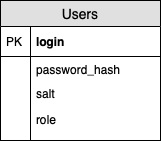

## Сервис Авторизации

### Диаграмма компонентов
* **Project.Auth.ClassDiagram**:
    **[Описание классов]**  

    **User** 
    **Назначение класса**: Класс хранит информацию о имени пользователя и его роли.
    **Атрибуты**: 

    |Название    |Тип     |Экспортируемый|Назначение                                                 |
    |------------|--------|--------------|-----------------------------------------------------------|
    |Login       |string  |Да            |Login пользователя                                         |
    |Role        |enum    |Да            |Роль пользователя(Студент, Преподаватель или Администартор)|
    |salt        |[32]byte|Нет           |соль(случайная последовательность байт)                    |
    |passwordHash|[32]byte|Нет           |хэш солёного пароля                                        |

    **Методы**: описание методов класса в виде таблицы:

    |Название            |Аргументы       |Возвращаемый тип|Экспортируемый|Назначение                                              |
    |--------------------|----------------|----------------|--------------|--------------------------------------------------------|
    |CheckPassword       |password: string|error           |Да            |Сверяет хэш сумму пароля пользователя и пароля аргумента|
    |SetPassword         |password: string|                |Да            |Устанавливает поля salt и passwordHash на основе пароля |
  
    **AuthorizationService** 
    **Назначение класса**: Класс содержит http-хэндлеры.
    **Атрибуты**: 

    |Название    |Тип          |Экспортируемый|Назначение                                                 |
    |------------|-------------|--------------|-----------------------------------------------------------|
    |DB          |*db.Database |Да            |Доступ к базе данных                                       |

    **Методы**: описание методов класса в виде таблицы:

    |Название            |Аргументы       |Возвращаемый тип|Экспортируемый|Назначение                                              |
    |--------------------|----------------|----------------|--------------|--------------------------------------------------------|
    |Login|w http.ResponseWriter, r *http.Request||Да|Производит разбор входных параметров из http-запроса и выполняет вход пользователя в систему|
    |Logout|w http.ResponseWriter, r *http.Request||Да|Производит разбор входных параметров из http-запроса и выполняет выход пользователя из системы|
    |User|w http.ResponseWriter, r *http.Request||Да|Производит разбор входных параметров из http-запроса и возвращает информацию о пользователе |
    |ChangePassword|w http.ResponseWriter, r *http.Request||Да|Производит разбор входных параметров из http-запроса и измененяет пароль пользователю|

      

    **[API сервиса]**  
    В случае ошибдок валидации код ответа будет 400(Bad Request).

    |URL|Метод HTTP|Тип тела запроса|Тип ответа|Назначение|
    |----------|----------|-------------------------------|--------------------------------------------------------|----------------------------|
    |/api/auth/login|POST|{Login:string,Password:string}|Успех: Код - 204, Проставляется Cookie "DM4-Auth" в формате JWT|Аутентификация пользователей|
    |/api/auth/logout|GET|-|Код - 204|Выход пользователя из системы|
    |/api/auth/user|GET|-|Успех: Код - 200, {Login:string, Role:string}, Если cookie не проставлена: Код - 403|Возвращает информацию о пользователе|
    |/api/auth/change_password|POST|{OldPassword:string, NewPasword:string}|Успех: Код - 204|Изменение пароля|

    <end>
* **Project.Auth.DatabaseSchema**:

    

    <end>

* **Project.Auth.DatabaseTable**:

    | Название поля | Тип поля | NULL | Значение по умолчанию | Назначение поля |
    | ------------- | -------- | ---- | --------------------- | --------------- |
    |login|text|NOT NULL|-|Содержит транслитерацию имени пользователя|
    |salt|char(32)|NOT NULL|-|Содержит случайно сгенерированную для каждого пользователя строку|
    |password_hash|char(32)|NOT NULL|-|Содержит SHA256(password + salt)|
    |role|enum("student",  "teacher", "admin")| NOT NULL|"student"| Содержит роль пользователя|

    <end>
