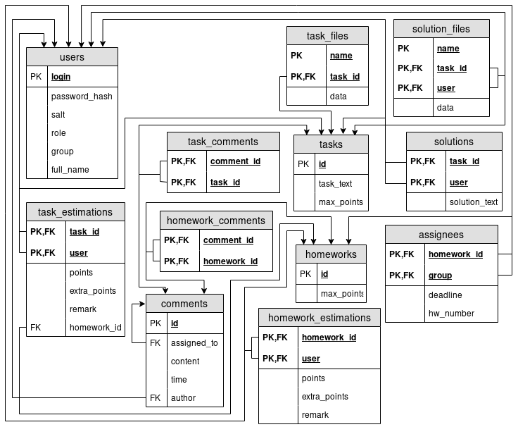

## Cервис обработки домашних заданий

* **Project.HomeworkService.ClassDiagram**:

      

    <end>

* **Project.HomeworkService.Classes.User**:
    **User**  
    *Назначение класса*: Класс хранит информацию об имени пользователя и его роли.

    *Атрибуты*:

    |Название    |Тип     |Экспортируемый|Назначение                                                 |
    |------------|--------|--------------|-----------------------------------------------------------|
    |Login       |string  |Да            |Login пользователя                                         |
    |Role        |enum    |Да            |Роль пользователя(Студент, Преподаватель или Администартор)|
    |salt        |[32]byte|Нет           |Соль(случайная последовательность байт)                    |
    |passwordHash|[32]byte|Нет           |Хэш солёного пароля                                        |
    |StudyGroup  |string  |Да            |Группа студента                                            |

    *Методы*:

    |Название            |Аргументы       |Возвращаемый тип|Экспортируемый|Назначение                                              |
    |--------------------|----------------|----------------|--------------|--------------------------------------------------------|
    |CheckPassword       |password: string|error           |Да            |Сверяет хэш сумму пароля пользователя и пароля аргумента|
    |SetPassword         |password: string|                |Да            |Устанавливает поля salt и passwordHash на основе пароля |

    <end>

* **Project.HomeworkService.Classes.Assignee**:
    **Assignee**  
    *Назначение класса*: Класс хранит информацию о получателе домашнего задания.

    *Атрибуты*: 

    |Название  |Тип      |Экспортируемый|Назначение                                             |
    |----------|---------|--------------|-------------------------------------------------------|
    |Deadline  |time.Time|Да            |Метка времени, до которого должно быть сдано задание   |
    |HwNum     |uint8    |Да            |Номер домашнего задания для данного получателя         |
    |StudyGroup|string   |Да            |Идентификатор группы, которой выдаётся домашнее задание|

    *Методы*:

    |Название |Аргументы|Возвращаемый тип|Экспортируемый|Назначение                                          |
    |---------|---------|----------------|--------------|----------------------------------------------------|
    |IsExpired| -       |bool            |Да            |Сверяет текущее время с установленной меткой времени|

    <end>

* **Project.HomeworkService.Classes.Comment**:
    **Comment**  
    *Назначение класса*: Класс хранит информацию о комментарии.

    *Атрибуты*: 

    |Название  |Тип      |Экспортируемый|Назначение                                                                               |
    |----------|---------|--------------|-----------------------------------------------------------------------------------------|
    |AssignedTo|*Comment |Да            |Указатель на комментарий, к которому данный коментарий является ответом (если такой есть)|
    |Content   |string   |Да            |Текст комментария                                                                        |
    |Time      |time.Time|Да            |Время создания комментария                                                               |
    |Author    |*User    |Да            |Указатель на автора комментария                                                          |

    *Методы*:

    |Название  |Аргументы|Возвращаемый тип|Экспортируемый|Назначение                                                      |
    |----------|---------|----------------|--------------|----------------------------------------------------------------|
    |IsAssigned| -       |bool            |Да            |Проверяет, является ли комментарий ответом на другой комментарий|

    <end>

* **Project.HomeworkService.Classes.Task**:
    **Task**  
    *Назначение класса*: Класс хранит информацию об отдельной задаче.

    *Атрибуты*: 

    |Название  |Тип       |Экспортируемый|Назначение                               |
    |----------|----------|--------------|-----------------------------------------|
    |Task      |string    |Да            |Условие задачи                           |
    |FileNames |[]string  |Да            |Массив названий приложенных файлов       |
    |MaxPoints |float64   |Да            |Максимальное количество баллов за задачу |
    |Comments  |[]*Comment|Да            |Массив указателей на комментарии к задаче|

    *Методы*:

    |Название     |Аргументы    |Возвращаемый тип|Экспортируемый|Назначение                          |
    |-------------|-------------|----------------|--------------|------------------------------------|
    |LoadFile     |name:string  |([]byte, error) |Да            |Загружает приложенный к задаче файл |
    |AddComment   |com: *Comment| -              |Да            |Добавляет комментарий к задаче      |
    |DeleteComment|com: *Comment|error           |Да            |Удаляет комментарий к задаче        |

    <end>

* **Project.HomeworkService.Classes.Homework**:
    **Homework**  
    *Назначение класса*: Класс хранит информацию об отдельном домашнем задании.

    *Атрибуты*: 

    |Название    |Тип       |Экспортируемый|Назначение                                                            |
    |------------|----------|--------------|----------------------------------------------------------------------|
    |tasks       |[]*Task   |Нет           |Массив задач, которые должны быть выполнены в рамках домашнего задания|
    |MaxPoints   |float64   |Да            |Максимвльное количество баллов за домашнее задание                    |
    |Assignees   |[]Assignee|Да            |Массив получаетей домашнего задания                                   |
    |Comments    |[]*Comment|Да            |Массив комментариев, оставленных к домашнему заданию                  |

    *Методы*:

    |Название      |Аргументы         |Возвращаемый тип|Экспортируемый|Назначение                                              |
    |--------------|------------------|----------------|--------------|--------------------------------------------------------------|
    |AddTask       |task: *Task       | -              |Да            |Добавляет в домашнее задание задачу                           |
    |AddAssignee   |assignee: Assignee| -              |Да            |Добавляет получателя домашнего задания                        |
    |AddComment    |com: *Comment     | -              |Да            |Добавляет комментарий к домашнему заданию                     |
    |DeleteTask    |task: *Task       |error           |Да            |Удаляет из домашнего задания задачу                           |
    |DeleteAssignee|group: string     |error           |Да            |Удаляет получателя домашнего задания                          |
    |DeleteComment |com: *Comment     |error           |Да            |Удаляет комментарий к домашнему заданию                       |
    |SelectTask    |idx: int          |(*Task, error)  |Да            |Возвращает указатель на задачу по её номеру в домашнем задании|

    <end>

* **Project.HomeworkService.Classes.TaskSolution**:
    **TaskSolution**  
    *Назначение класса*: Класс хранит информацию о решении задачи.

    *Атрибуты*: 

    |Название |Тип     |Экспортируемый|Назначение              |
    |---------|--------|--------------|------------------------|
    |Student  |*User   |Да            |Студент, решивший задачу|
    |Task     |*Task   |Да            |Решённая задача         |
    |Solution |string  |Да            |Текст решения           |
    |FileNames|[]string|Да            |Имена приложенных файлов|

    *Методы*:

    |Название|Аргументы  |Возвращаемый тип|Экспортируемый|Назначение                          |
    |--------|-----------|----------------|--------------|------------------------------------|
    |LoadFile|name:string|([]byte, error) |Да            |Загружает приложенный к решению файл|

    <end>

* **Project.HomeworkService.Classes.TaskEstimation**:
    **TaskEstimation**  
    *Назначение класса*: Класс хранит информацию о проведённном оценивании отдельной задачи.

    *Атрибуты*: 

    |Название   |Тип          |Экспортируемый|Назначение                                       |
    |-----------|-------------|--------------|-------------------------------------------------|
    |Sol        |*TaskSolution|Да            |Указатель на оцениваемое решение задачи          |
    |Points     |float64      |Да            |Количество баллов, выставленное за решение задачи|
    |ExtraPoints|float64      |Да            |Дополнительные баллы                             |
    |Remark     |string       |Да            |Пояснение от преподавателя                       |

    *Методы*:

    |Название |Аргументы|Возвращаемый тип   |Экспортируемый|Назначение                            |
    |---------|---------|-------------------|--------------|--------------------------------------|
    |IsValid  | -       |bool               |Да            |Проверяет валидность оценивания задачи|

    <end>

* **Project.HomeworkService.Classes.HomeworkEstimation**:
    **HomeworkEstimation**  
    *Назначение класса*: Класс хранит информацию о проведённном оценивании домашнего задания.

    *Атрибуты*: 

    |Название      |Тип              |Экспортируемый|Назначение                                  |
    |--------------|-----------------|--------------|--------------------------------------------|
    |Homework      |*Homework        |Да            |Указатель на оцениваемое домашнее задание   |
    |estimatedTasks|[]*TaskEstimation|Нет           |Массив оцененных задач                      |
    |Points        |float64          |Да            |Сумма баллов, полученных за домашнее задание|
    |Remark        |string           |Да            |Пояснение от преподавателя                  |
    |ExtraPoints   |float64          |Да            |Дополнительные баллы                        |

    *Методы*:

    |Название  |Аргументы            |Возвращаемый тип        |Экспортируемый|Назначение                                        |
    |----------|---------------------|------------------------|--------------|--------------------------------------------------|
    |AddTask   |task: *TaskEstimation| -                      |Да            |Добавляет оцененную задачу                        |
    |DeleteTask|task: *TaskEstimation|error                   |Да            |Удаляет оцененную задачу                          |
    |SelectTask|idx: int             |(*TaskEstimation, error)|Да            |Возвращает указатель на оененную задачу по индексу|
    |IsValid   | -                   |bool                    |Да            |Проверяет валидность оценивания всех задач        |

    <end>

* **Project.HomeworkService.Classes.HomeworkService**:
    **HomeworkService**  
    *Назначение класса*: Класс содержит http-хендлеры.

    *Атрибуты*: 

    |Название|Тип    |Экспортируемый|Назначение               |
    |--------|-------|--------------|-------------------------|
    |db      |*sql.DB|Нет           |Подключение к базе данных|

    *Методы*:

    |Название             |Аргументы                              |Возвращаемый тип|Экспортируемый|Назначение|
    |---------------------|---------------------------------------|----------------|--------------|----------|
    |SetConnection        |db: *sql.DB                            | -              |Да            |Устанавливает атрибут db|
    |AddComment           |w: http.ResponseWriter, r: http.Request| -              |Да            |Производит разбор входных параметров из http-запроса и добавляет комментарий|
    |RemoveComment        |w: http.ResponseWriter, r: http.Request| -              |Да            |Производит разбор входных параметров из http-запроса и удаляет комментарий|
    |AddAssignee          |w: http.ResponseWriter, r: http.Request| -              |Да            |Производит разбор входных параметров из http-запроса и добавляет получателя домашнего задания|
    |RemoveAssignee       |w: http.ResponseWriter, r: http.Request| -              |Да            |Производит разбор входных параметров из http-запроса и удаляет получателя домашнего задания|
    |CreateTask           |w: http.ResponseWriter, r: http.Request| -              |Да            |Производит разбор входных параметров из http-запроса и добавляет отдельную задачу в банк задач|
    |DeleteTask           |w: http.ResponseWriter, r: http.Request| -              |Да            |Производит разбор входных параметров из http-запроса и удаляет отдельную задачу из банка задач|
    |AddTask              |w: http.ResponseWriter, r: http.Request| -              |Да            |Производит разбор входных параметров из http-запроса и добавляет отдельную задачу в домашнее задание|
    |RemoveTask           |w: http.ResponseWriter, r: http.Request| -              |Да            |Производит разбор входных параметров из http-запроса и удаляет отдельную задачу из домашнего задания|
    |AddHomework          |w: http.ResponseWriter, r: http.Request| -              |Да            |Производит разбор входных параметров из http-запроса и добавляет домашнее задание|
    |RemoveHomework       |w: http.ResponseWriter, r: http.Request| -              |Да            |Производит разбор входных параметров из http-запроса и удаляет домашнее задание|
    |AddSolution          |w: http.ResponseWriter, r: http.Request| -              |Да            |Производит разбор входных параметров из http-запроса и добавляет решение задачи|
    |RemoveSolution       |w: http.ResponseWriter, r: http.Request| -              |Да            |Производит разбор входных параметров из http-запроса и удаляет решение задачи|
    |EstimateTask         |w: http.ResponseWriter, r: http.Request| -              |Да            |Производит разбор входных параметров из http-запроса и сохраняет оценивание решения отдельной задачи|
    |EstimateHW           |w: http.ResponseWriter, r: http.Request| -              |Да            |Производит разбор входных параметров из http-запроса и сохраняет оценивание домашнего задания|
    |GetCommentsList      |w: http.ResponseWriter, r: http.Request| -              |Да            |Производит разбор входных параметров из http-запроса и выдаёт список комментариев (в том числе вложенных) к задаче или домашнему заданию|
    |GetFilteredHWs       |w: http.ResponseWriter, r: http.Request| -              |Да            |Производит разбор входных параметров из http-запроса и производит выборку домашних заданий по заданным параметрам|
    |GetFilteredTasks     |w: http.ResponseWriter, r: http.Request| -              |Да            |Производит разбор входных параметров из http-запроса и производит выборку задач по заданным параметрам|
    |GetFilteredAssignees |w: http.ResponseWriter, r: http.Request| -              |Да            |Производит разбор входных параметров из http-запроса и производит выборку получателей домашних заданий по заданным параметрам|
    |GetFilteredSolutions |w: http.ResponseWriter, r: http.Request| -              |Да            |Производит разбор входных параметров из http-запроса и производит выборку решений задач по разным параметрам|
    |GetFilteredEstimation|w: http.ResponseWriter, r: http.Request| -              |Да            |Производит разбор входных параметров из http-запроса и производит выборку оценивания домашнего задания и задач в его составе по заданным параметрам|

    <end>

* **Project.HomeworkService.API**:
    **API сервиса**  

    В случае ошибок валидации, код ответа будет 400 (Bad Request), в случае ошибок сервера - 500 (Internal Server Error); ошибки доступа рассмотрены в проекте сервиса авторизации.  
    В запросах на получение фильтрованных выборок в качестве GET параметров кроме конкретных значений может передаваться ключевое слово `any`.

    |URL                                                                           |Метод HTTP|Тип тела запроса                                                    |Тип ответа|Назначение|
    |------------------------------------------------------------------------------|----------|--------------------------------------------------------------------|----------|----------|
    |/api/hw/comment                                                               |PUT       |{ObjectType:string,ObjectID:num,AssignedToID:num,Content:string}    |Успех: Код - 200, {ID:num}|Комментирование или ответ на комментарий под задачей или домашним заданием|
    |/api/hw/comment                                                               |DELETE    |{ID:num}                                                            |Успех: Код - 200|Удаление комментария|
    |/api/hw/assignee                                                              |PUT       |{Deadline:num,HwNum:num,Group:string,HwID:num}                      |Успех: Код - 200|Добавление получателя домашнего задания|
    |/api/hw/assignee                                                              |DELETE    |{Group:string, HwID:num}                                            |Успех: Код - 200|Удаление получателя домашнего задания|
    |/api/hw/taskBank                                                              |PUT       |{Task:string,MaxPoints:num}, Files:[]blob                           |Успех: Код - 200, {ID:num}|Добавление задачи в банк задач|
    |/api/hw/taskBank                                                              |DELETE    |{ID:num}                                                            |Успех: Код - 200|Удаление задачи из банка задач|
    |/api/hw/task                                                                  |PUT       |{HwID:num,TaskID:num}                                               |Успех: Код - 200|Добавление задачи в домашнее задание|
    |/api/hw/task                                                                  |DELETE    |{HwID:num,TaskID:num}                                               |Успех: Код - 200|Удаление задачи из домашнего задания|
    |/api/hw/homework                                                              |PUT       | -                                                                  |Успех: Код - 200, {ID:num}|Добавление нового домашнего задания|
    |/api/hw/homework                                                              |DELETE    |{ID:num}                                                            |Успех: Код - 200|Удаление домашенего задания|
    |/api/hw/solution                                                              |PUT       |{Student:string,TaskID:num,Solution:string}, Files:[]blob           |Успех: Код - 200|Добавление решения задачи|
    |/api/hw/solution                                                              |DELETE    |{Student:string,TaskID:num}                                         |Успех: Код - 200|Удаление решения задачи|
    |/api/hw/taskEst                                                               |POST      |{Student:string,TaskID:num,Points:num,ExtraPoints:num,Remark:string}|Успех: Код - 200|Оценивает решение задачи пользователем|
    |/api/hw/homeworkEst                                                           |POST      |{Student:string,TaskID:num,HwID:num,ExtraPoints:num,Remark:string}  |Успех: Код - 200|Оценивает выполенение домашнего задания|
    |/api/hw/comments?{Type=}&{ParentID=}&{ID=}&{IsAssigned=}&{DateFrom=}&{DateTo=}|GET       | -                                                                  |Успех: Код - 200, {Lines:num,Comments:\[\]{Content:string,Time:num,ID:num,AssignedToId:num,Author:{Login:string,Role:string,Group:string,FullName:string}}}|Получает выборку комментариев по заданным фильтрам|
    |/api/hw/HWs?{AssignedToGroup=}&{ContainsTaskID=}&{ID=}&{CommentID=}           |GET       | -                                                                  |Успех: Код - 200, {Lines:num,Homeworks:\[\]{TaskIDs:\[\]num,MaxPoints:num,AssigneeGroups:\[\]string,CommentIDs:\[\]num}|Получает выборку домашних заданий по заданным фильтрам|
    |/api/hw/tasks?{UsedInHwID=}&{ID=}&{CommentID=}&{Group=}                       |GET       | -                                                                  |Успех: Код - 200, {Lines:num,Tasks:\[\]{ID:num,Task:string,Files:\[\]blob,MaxPoints:num,CommentIDs:[]num}}|Получает выборку задач по заданным фильтрам|
    |/api/hw/assignees?{Group=}&{TaskId=}&{HwID=}&{DeadlineFrom=}&{DeadlineTo=}    |GET       | -                                                                  |Успех: Код - 200, {Lines:num,Assignies:\[\]{HwID:num,Deadline:num,HwNum:num,Group:string}}|Получает выборку получателей домашнего задания по заданным фильтрам|
    |/api/hw/solutions?{Student=}&{Group=}&{TaskID=}&{inHwID=}                     |GET       | -                                                                  |Успех: Код - 200, {Lines:num,Solutions:\[\]{Student:string,TaskID:num,Solution:string,Files:\[\]blob}}|Получает выборку решений задач по заданным фильтрам|
    |/api/hw/estimations?{Group=}&{Student=}&{HwID=}&{TaskID=}                     |GET       | -                                                                  |Успех: Код - 200, {Lines:num,Estimations:\[\]{Student:string,Group:string,HwID:num,Points:num,ExtraPoints:num,Remark:string,TasksEst:\[\]{TaskID:num,Points:num,ExtraPoints:num,Remark:string}}}|Получает выборку оцениваний домашних заданий по заданным фильтрам|

    <end>

* **Project.HomeworkService.Database.Schema**:

    

    <end>

* **Project.HomeworkService.Database.Table.Users**:
    Таблица **users** содержит информацию о пользователях системы.  

    |Название поля|Тип поля                           |NULL|Значение по умолчанию|Назначение поля                                                  |
    |-------------|-----------------------------------|----|---------------------|-----------------------------------------------------------------|
    |login        |text                               |Нет | -                   |Содержит логин пользователя                                      |
    |salt         |char(32)                           |Нет | -                   |Содержит случайно сгенерированную для каждого пользователя строку|
    |password_hash|char(32)                           |Нет | -                   |Содержит SHA256(password + salt)                                 |
    |role         |enum("student", "teacher", "admin")|Нет |"student"            |Содержит роль пользователя                                       |
    |group        |text                               |Да  | -                   |Содержит учебную группу студента                                 |
    |full_name    |text                               |Нет | -                   |Содержит ФИО пользователя                                        |

    <end>

* **Project.HomeworkService.Database.Table.Tasks**:
    Таблица **tasks** содержит информацию об отдельных задачах.  

    
    |Название поля|Тип поля                           |NULL|Значение по умолчанию|Назначение поля                                  |
    |-------------|-----------------------------------|----|---------------------|-------------------------------------------------|
    |id           |int unsigned                       |Нет | -                   |Содержит идентификатор задачи                    |
    |task_text    |text                               |Нет | -                   |Содержит текстовое описание задачи               |
    |max_points   |tinyint unsigned                   |Нет | -                   |Содержит максимальное количество баллов за задачу|

    <end>

* **Project.HomeworkService.Database.Table.TaskFiles**:
    Таблица **task_files** содержит в бинарном виде файлы, приложенные к задачам.  

    |Название поля|Тип поля    |NULL|Значение по умолчанию|Назначение поля              |
    |-------------|------------|----|---------------------|-----------------------------|
    |name         |text        |Нет | -                   |Содержит имя файла           |
    |task_id      |int unsigned|Нет | -                   |Содержит идентификатор задачи|
    |data         |mediumblob  |Нет | -                   |Содержит файл в бинарном виде|

    <end>

* **Project.HomeworkService.Database.Table.Solutions**:
    Таблица **solutions** содержит информацию о решениях задач пользователями.  

    
    |Название поля|Тип поля                           |NULL|Значение по умолчанию|Назначение поля                                  |
    |-------------|-----------------------------------|----|---------------------|-------------------------------------------------|
    |task_id      |int unsigned                       |Нет | -                   |Содержит идентификатор задачи                    |
    |user         |text                               |Нет | -                   |Содержит идентификатор пользователя              |
    |solution_text|text                               |Нет | -                   |Содержит текст решения                           |

    <end>

* **Project.HomeworkService.Database.Table.SolutionFiles**:
    Таблица **solution_files** содержит в бинарном виде файлы, приложенные к решениям.  

    |Название поля|Тип поля    |NULL|Значение по умолчанию|Назначение поля                    |
    |-------------|------------|----|---------------------|-----------------------------------|
    |name         |text        |Нет | -                   |Содержит имя файла                 |
    |task_id      |int unsigned|Нет | -                   |Содержит идентификатор задачи      |
    |user         |text        |Нет | -                   |Содержит идентификатор пользователя|
    |data         |mediumblob  |Нет | -                   |Содержит файл в бинарном виде      |

    <end>

* **Project.HomeworkService.Database.Table.Homeworks**:
    Таблица **homeworks** содержит информацию о домашних заданиях.  

    |Название поля|Тип поля                           |NULL|Значение по умолчанию|Назначение поля                                            |
    |-------------|-----------------------------------|----|---------------------|-----------------------------------------------------------|
    |id           |int unsigned                       |Нет | -                   |Содержит идентификатор домашнего задания                   |
    |max_points   |tinyint unsigned                   |Нет | -                   |Содержит максимальное количество баллов за домашнее задание|

    <end>

* **Project.HomeworkService.Database.Table.Assignees**:
    Таблица **assignees** содержит информацию о выдаче домашних заданий.  

    |Название поля|Тип поля                           |NULL|Значение по умолчанию|Назначение поля                                                     |
    |-------------|-----------------------------------|----|---------------------|--------------------------------------------------------------------|
    |homework_id  |int unsigned                       |Нет | -                   |Содержит идентификатор домашнего задания                            |
    |group        |text                               |Нет | -                   |Содержит группу, которой назначено домашнее задание                 |
    |deadline     |timestamp                          |Нет | -                   |Содержит метку времени, до которой необходимо сделать данное задание|
    |hw_number    |tinyint unsigned                   |Да  | -                   |Номер данного домашнего задания в семестре для данной группы        |

    <end>

* **Project.HomeworkService.Database.Table.Comments**:
    Таблица **comments** содержит комментарии к задачам или домашним заданиям.  

    |Название поля|Тип поля    |NULL|Значение по умолчанию|Назначение поля                                                           |
    |-------------|------------|----|---------------------|--------------------------------------------------------------------------|
    |id           |int unsigned|Нет | -                   |Содержит идентификатор комментария                                        |
    |assigned_to  |int unsigned|Да  | -                   |Содержит идентификатор комментария, на который данный комментарий отвечает|
    |content      |text        |Нет | -                   |Содержит текст комментария                                                |
    |time         |timestamp   |Нет | -                   |Содержит время создания комментария                                       |
    |author       |text        |Нет | -                   |Содержит логин (идентификатор пользователя) автора комментария            |

    <end>

* **Project.HomeworkService.Database.Table.TaskComments**:
    Таблица **task_comments** служит для связи таблиц comments и tasks.  

    |Название поля|Тип поля                           |NULL|Значение по умолчанию|Назначение поля                   |
    |-------------|-----------------------------------|----|---------------------|----------------------------------|
    |comment_id   |int unsigned                       |Нет | -                   |Содержит идентификатор комментария|
    |task_id      |int unsigned                       |Нет | -                   |Содержит идентификатор задачи     |

    <end>

* **Project.HomeworkService.Database.Table.HomeworkComments**:
    Таблица **homework_comments** служит для связи таблиц comments и homework.  

    |Название поля|Тип поля                           |NULL|Значение по умолчанию|Назначение поля                         |
    |-------------|-----------------------------------|----|---------------------|----------------------------------------|
    |comment_id   |int unsigned                       |Нет | -                   |Содержит идентификатор комментария      |
    |homework_id  |int unsigned                       |Нет | -                   |Содержит идентификатор домашнего задания|

    <end>

* **Project.HomeworkService.Database.Table.TaskEstimations**:
    Таблица **task_estimations** содержит информацию об оценивании решений задач.  

    |Название поля|Тип поля                           |NULL|Значение по умолчанию|Назначение поля                                                                                      |
    |-------------|-----------------------------------|----|---------------------|-----------------------------------------------------------------------------------------------------|
    |task_id      |int unsigned                       |Нет | -                   |Содержит идентификатор задачи                                                                        |
    |user         |text                               |Нет | -                   |Содержит идентификатор пользователя                                                                  |
    |points       |float                              |Нет | -                   |Содержит основную оценку за задачу                                                                   |
    |extra_points |float                              |Да  |NULL                 |Содержит дополнительные баллы за задачу                                                              |
    |remark       |text                               |Да  |NULL                 |Содержит пояснения к оцениванию или ошибкам                                                          |
    |homework_id  |int unsigned                       |Нет | -                   |Содержит идентификатор домашнего задания, в котором содержится данная задача для данного пользователя|

    <end>

* **Project.HomeworkService.Database.Table.HomeworkEstimations**:
    Таблица **homework_estimations** содержит информацию об оценивании домашних заданий.  

    |Название поля|Тип поля    |NULL|Значение по умолчанию|Назначение поля                                               |
    |-------------|------------|----|---------------------|--------------------------------------------------------------|
    |homework_id  |int unsigned|Нет | -                   |Содержит идентификатор домашнего задания                      |
    |user         |text        |Нет | -                   |Содержит идентификатор пользователя                           |
    |points       |float       |Нет | -                   |Содержит оценку за домашнее задание                           |
    |extra_points |float       |Да  |NULL                 |Содержит дополнительные баллы за домашнее задание             |
    |remark       |text        |Да  |NULL                 |Содержит пояснения к оцениванию или ошибкам в домашнем задании|

    <end>
