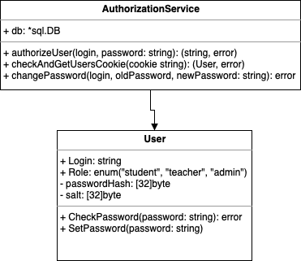

## Диаграмма классов: сервис авторизации

Данный сервис реализует компонент **AuthService**, обозначенный на диаграмме компонентов системы. Исходя из требований, были выделены следующие классы:

* User - класс, описывающий абстрактного пользователя системы.
* Teacher - класс, описывающий преподавателя.
* Student - класс, описывающий студента.
* Administrator - класс, описывающий администратора.
* AuthorizationService - утилитарный класс, обеспечивающий связь с базой данных.

