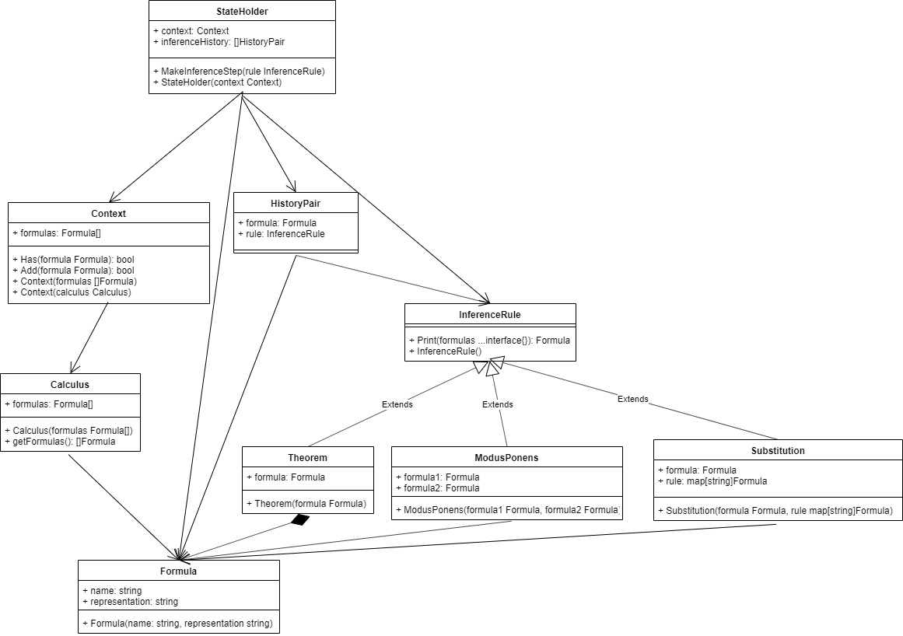

## Диаграмма классов: сервис поддержки вывода формул

Данный сервис реализует компонент **InferenceService**, обозначенный на диаграмме компонентов системы. Исходя из требований, были выделены следующие классы:

* StateHolder - класс, хранящий общее состояние вывода конкретной формулы.
* Context - класс, хранящий в себе контекст вывода: список на данный момент доступных для использования в выводе формул.
* HistoryPair - утилитарный класс, описывающий пару из формулы и правила вывода, по которому эта формулы была получена.
* Calculus - класс, описывающий некоторое исчисление.
* InferenceRule - абстрактный класс, описывающий функциональность правила вывода.
* Formula - класс, описывающий непосредственно формулу.
* Substitution - класс, описывающий правило вывода: подстановка переменных.
* ModusPonens - класс, описывающий правило вывода: modus ponens.
* Theorem - класс, описывающий правило вывода: существующая в контексте формула.

