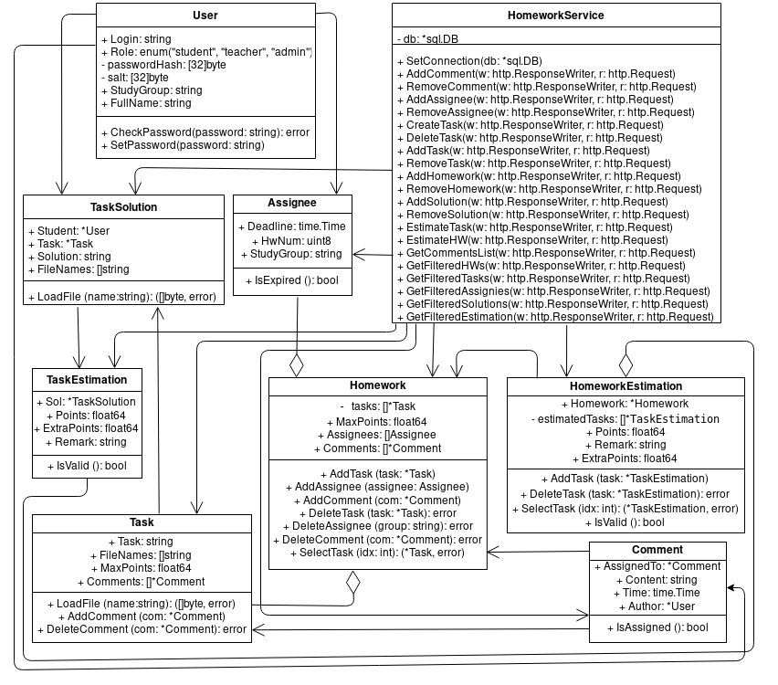

## Диаграмма классов: сервис обработки дз

Данный сервис реализует компонент **HomeworkService**, обозначенный на диаграмме компонентов системы. Исходя из требований, были выделены следующие классы:

* Homework - класс, описывающий домашнее задание в целом.
* Assignee - класс, устанавливающий соответствие между домашним заданием и группой студентов, которой выдано это домашнее задание.
* Task - класс, описывающий одну задачу, содержащуюся в домашнем задании.
* Comment - класс, описывающий комментарий к домашнему заданию.
* HomeworkEstimation - класс, описывающий оценку за домашнее задание в целом.
* TaskEstimation - класс, описывающий оценку за одну задачу из домашнего задания.

