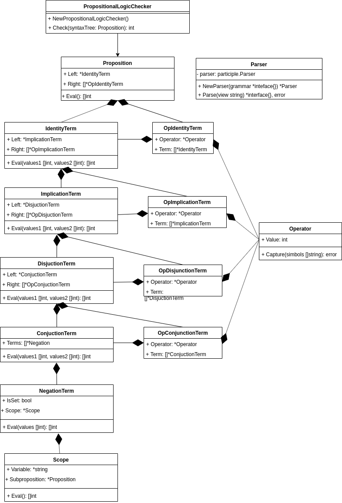

## Диаграмма классов: сервис проверки истинности

Данный сервис реализует компонент **CheckService**, обозначенный на диаграмме компонентов системы. Исходя из требований, были выделены следующие классы:

* PropositionalLogicChecker - класс, инкаплулирующий в себе проверку инстинности формулы.
* Proposition - класс, описывающий пропозициональную формулу.
* IdentityTerm - класс, описывающий операцию эквивалентности.
* OpIdentityTerm - класс, описывающий выражение, состоящее из набора термов, разделенных оператором эквивалентности.
* ImplicationTerm - класс, описывающий операцию импликации.
* OpImplicationTerm - класс, описывающий выражение, состоящее из набора термов, разделенных оператором импликации.
* DisjunctionTerm - класс, описывающий операцию дизъюнкции.
* OpDisjunctionTerm - класс, описывающий выражение, состоящее из набора термов, разделенных оператором дизъюнкции.
* ConjunctionTerm - класс, описывающий операцию конъюнкции.
* OpConjunctionTerm - класс, описывающий выражение, состоящее из набора термов, разделенных оператором конъюнкции.
* NegationTerm - класс, описывающий операцию отрицания.
* Operator - класс, описывающий произвольную операцию.
* Scope - класс, описывающий переменную.
* Parser - утилитарный класс, реализующий преобразование строкового представления формулы в синтаксическое дерево.

