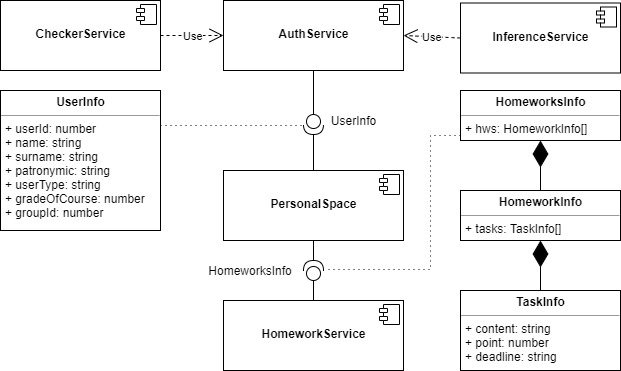

## Диаграмма компонентов системы

Исходя из требований, были выделены следующие 5 компонентов разрабатываемой системы:

1. AuthService - сервис авторизации.
1. PersonalSpace - личный кабинет.
1. HomeworkService - сервис обработки домашних заданий.
1. CheckerService - сервис проверки истинности формул.
1. InferenceService - сервис поддержки вывода формул.

Классы UserInfo и HomeworksInfo служат для транспорта данных между обозначенными на диаграмме сервисами.

