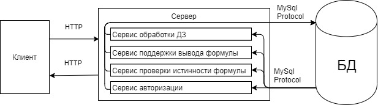

## Общая архитектура системы

По данной архитектуре у клиентов присутствует только презентационная логика. Логика работы отдельных сервисов и логика доступа к ресурсам остаются на сервере. Сервер является отдельным физически отдалённым от клиента сервером.

Освобождение программного обеспечения клиентского звена от реализации сервисов делает его более «лёгким», снижая требования к аппаратным средствам клиента, упрощая и унифицируя программные средства, с которыми работает конечный пользователь.

Перевод работы сервисов на сервер существенно облегчает проблемы, связанные с модернизацией и сопровождением прикладного программного обеспечения. Так же повышает надёжность и защищённость системы, её переносимость и масштабируемость.