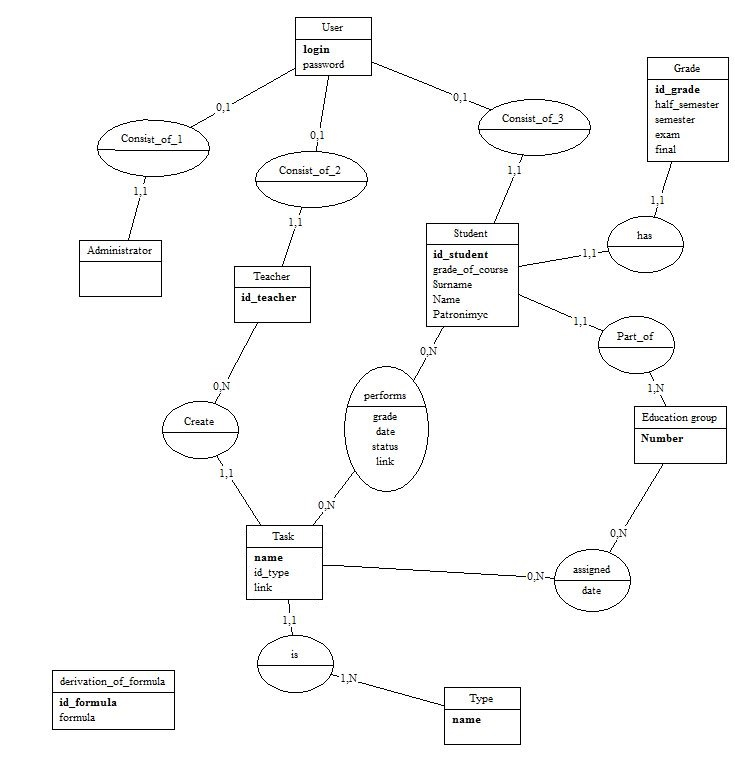
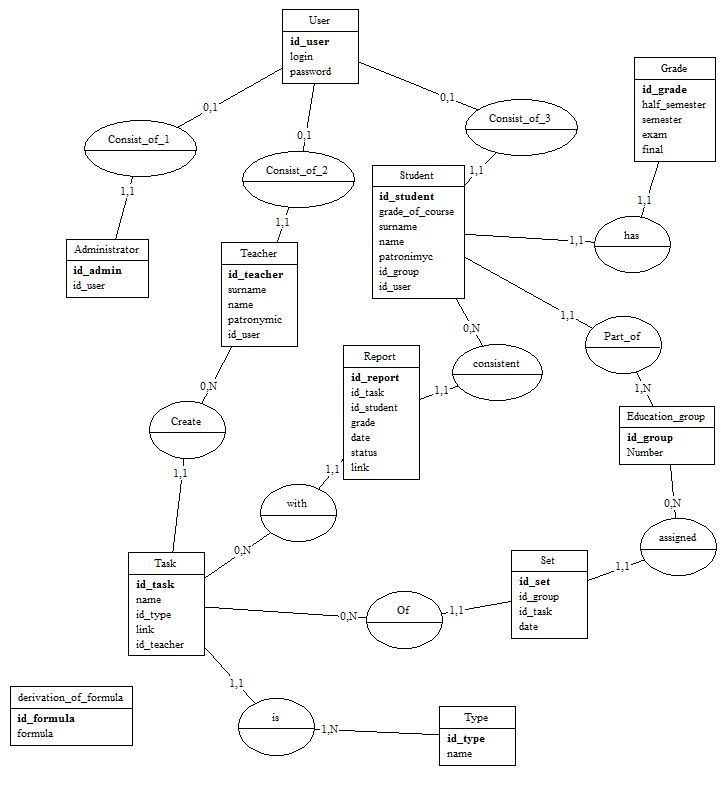

## Описание базы данных

### Концептуальная модель предметной области 

Система предназначена для удобного пользования учащимися и студентами. Так как доступ к системе осуществляется на основе 3 ролей (исходя из требований "Сервис авторизации и аутентификации"), то пользователь *User* может быть одного из трех типов администратор *Administramor*, учитель *Teacher*, студент *Student*.  
Каждый *Student* иммет балл *Grade*, где храняться результаты полусеместрового, семестрового, экзаменационного контроля, а также итоговый балл для каждого ученика.  
Каждый *Student* состоит в учебной группе *Education_group*, каждой из которой *Teacher* может назначать задание *Task* (где располагаются ссылки на задание), которое до этого было им же создано.  
*Task* может быть одного из 2 типов *Type*: домашняя или контрольная работа.  
Также в базе данных хранятся формулы *Derivation_of_formula*, которые используются в сервисе проверки истинности формул.

Таким образом, создана модель КМПО (ASIS), которая фиксирует понятийный базис будущей системы. Данная инфологическая модель базируется на модели «сущность-связь», поэтому ER-модель строится с помощью средств Silverrun. 

### Оценка мощностных характеристик

|Сущность/связь|Минимальная|Средняя|Макисмальная|
|:---:|---:|---:|---:|
|User|22|415|630|
|Administrator|1|5|10|
|Teacher|1|10|20|
|Student|20|400|600|
|Grade|20|400|600|
|Education_Group|5|20|20|
|Task|10|50|90|
|Type|2|2|2|
|Derivation_of_formula||||
|Consist_of_1|1|5|10|
|Consist_of_2|1|10|20|
|Consist_of_3|20|400|600|
|Has|20|400|600|
|Part_of|20|400|600|
|Performs|40|4000|2700|
|Assigned|10|200|360|
|Create|10|50|90|
|Is|10|50|90|

Оценка мощностных характеристик определяется на основании анализа. Из среднего рассчета количества человек в группе (приблизительно 20), на потоке 4 группы и  из расчета, что данные о студентах в системе храняться до выпуска (5 семестров), т.е в каждый момент для сущности студент имеем среднюю мощность 20*4*5=200 студентов. (Минимально, если в каждой группе по 1 человеку и предмет преподается только у одной группы, максимально если по 30 человек в группе). Количество администраторов не менее 1 и не более 10. Количество преподавателей курса ДМ-4 не менее 1 и не более 20. Суммирую данны расчеты определяется мощность сущности *User*.

Так как *Grade* определяется однозначно для каждого *Student* и наоборот, то их мощности одинаковы. Количество образовательных групп не менее 5 и не более 20 за 5 семестров.  
Для каждой группы в течении семестра должно быть не менее 2 работ(полусеместровая и зачетная), помимо этого может быть до 16 домашних заданий.  
Мощности связей рассчитываются исходя из мощностей сущностей. Мощность *Consist_of_1*, *Consist_of_2*, *Consist_of_3* равны мощностям сущностей *Administrator*, *Teacher*, *Student* соответственно. Аналогично с мощностью связи *Has* и *Part_of*. Мощность связи *Performs* рассчитывается исходя из того что в каждый семестр для каждого члена группы иммеется отчет для каждой работы, назначенных в этот семестр. Аналогично с мощностью связи *Assigned*.

### Концептуальная модель базы данных

Переход от КМПО к КМБД происходит с помощью введения идентификаторов, используя правила перехода от КМПО к КМБД. Таким образом, концептуальная модель базы данных, представленная графически с помощью средств Silverrun выглядит следующим образом:

