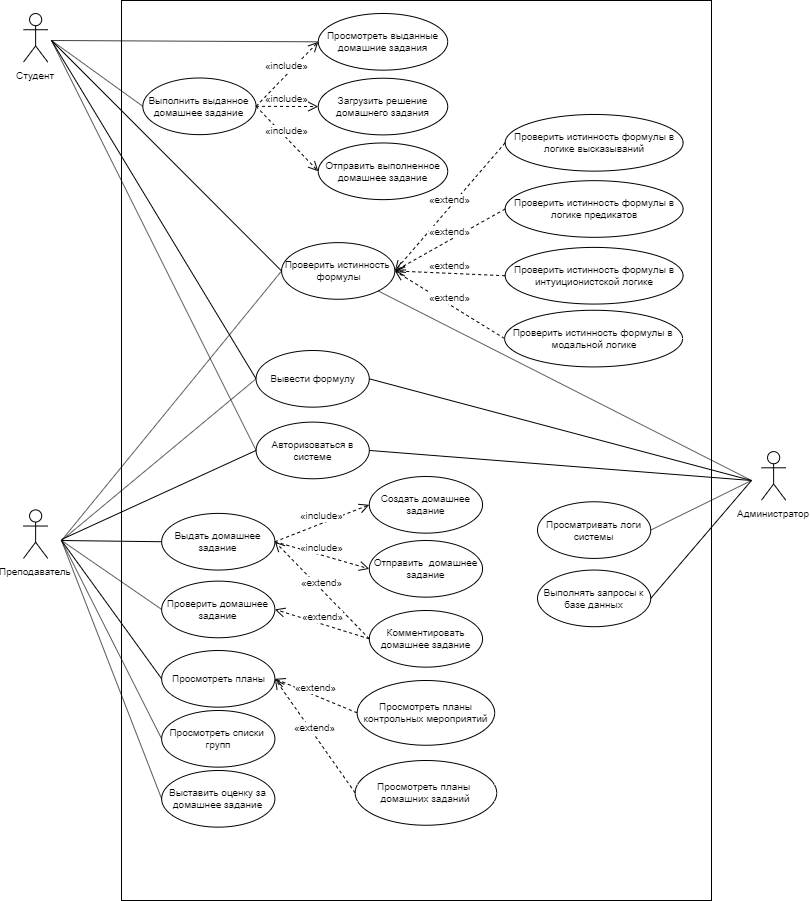
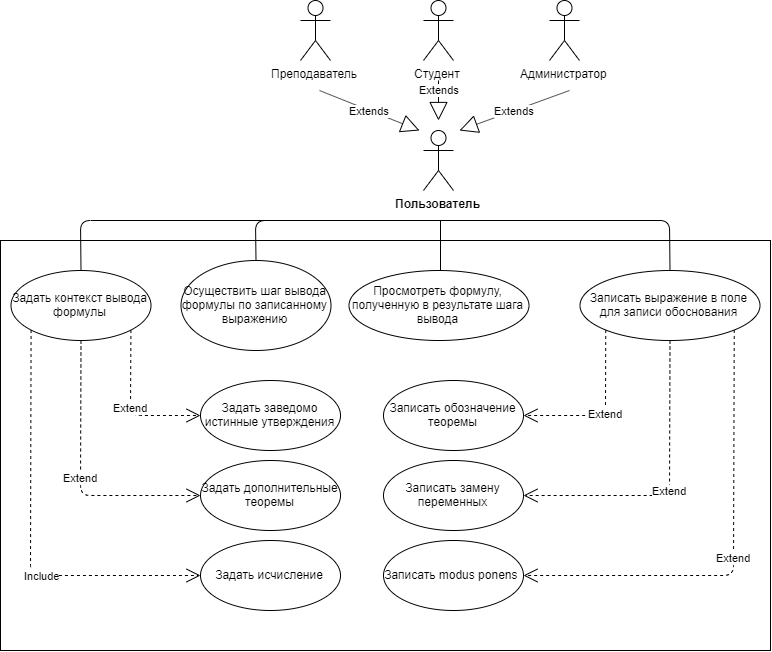

## Сценарии использования

### Сервис поддержки вывода формулы

**Контекст использования:** Ускорение работы с большими формулами, облегчение работы с теоремой дедукции.

**Основные действующие лица:** Студент, преподаватель, администратор.

**Основной сценарий:**

1. Пользователь авторизуется в системе.
2. Пользователь задает *контекст ввода*: исчисление, дополнительные теоремы и заведомо истинные утверждения.
3. В правое текстовое поле пользователь записывает *обоснование*: замена переменных, modus ponens, теорема.
4. В левом текстовом поле записывается результат обработки выражения в зависимости от того, что именно пользователь ввел в правое поле.

**Расширение:**

3.а.1. Входные данные введены некорректно.

3.а.2. В левом поле выводится сообщение об ошибке.

**Предусловие:** Авторизация в системе.

**Постусловие:** Результат обработки выражения.

### Сервис проверки истинности формул

**Контекст использования:** Проверка истинности формулы
  
**Основные действующие лица:** Студент, преподаватель, администратор

**Основной сценарий:**

1. Пользователь выбирает исчисление, в котором может быть записана формула.
2. Пользователь записывает формулу.
3. Пользователь нажимает кнопку "проверить".
4. Пользователь получает результат проверки истинности формулы.

**Расширения:** 

2.а.1. Пользователь некорретно ввел формулу.

2.а.2. Пользователь получил сообщение об ошибке.

**Предусловие:** Пользователь авторизован.

**Постусловие:** Пользователь получил результат проверки истинности формулы.

### Сервис обработки домашних заданий

#### Выдача и проверка домашнего задания

**Контекст использования:** Выдача преподавателем домашнего задания студентам и последующая его проверка.

**Основные действующие лица:** Преподаватель.

**Основной сценарий:**

1. Преподаватель заходит в систему выдачи домашнего задания.
2. Выбирает группу, которой необходимо отправить домашнее задание. 
3. Проставляет дату, к которой необходимо сдать работу.
4. В текстовом поле "Задание" прописывает требования к выполнению работы. 
5. При необходимости нажимает на кнопку "Загрузить" и прикрепляет необходимые файлы.
6. При необходимости в поле "Комментарии" прописывает комментарии к выполнению.
7. Нажатием на кнопку "Отправить" рассылает задание выбранным студентам.
8. После того, как студент прислал выполненное домашнее задание, преподаватель заходит в раздел с готовой присланной работой и проверяет его.
9. Если в работе существуют ошибки, которые необходимо исправить, преподаватель прописывает в поле "Комментарий" то, что нужно исправить.
10. Кнопкой "Отправить" отсылает задание с комментариями студенту на доработку.
11. Если задание выполненно верно, проставляет итоговую оценку в поле "Оценка".

**Расширение:**

5.а.1. Невозможно загрузить файл, т.к. формат выбранного файла не распознается.

5.а.2. Выдача сообщения об ошибке: "Файл слишком большой и не может быть загружен".

7.a.1. Если студенты или дата не выбраны, выводит сообщение об ошибке "Заполните все обязательные поля".

**Предусловие:** Авторизация в системе.

**Постусловие:** Отображение оценки, выставленной студенту за домашнее задание.

#### Выполнение домашнего задания

**Контекст использования:** Просмотр студентом выданного домашнего задания и последующая загрузка выполненного задания в систему.

**Основные действующие лица:** Студент.

**Основной сценарий:**

1. Студент заходит в раздел с домашним заданием.
2. Просматривает описание необходимого задания или недоделанного задания и комментарии преподавателя, если такие есть.
3. Выполняет задание в текстовом поле; если необходимы дополнительные файлы, нажимает на кнопку "Загрузить файл" и выбирает необходимые документы для загрузки.
4. При завершении выполнения нажатием на кнопку "Отправка" выполняет загрузка файла на сервер, где его сможет в дальнейшем проверить преподаватель.

**Расширение:**

3.а.1. Невозможно загрузить файл, т.к. формат выбранного файла не распознается.

3.а.2. Выдача сообщения об ошибке: "Файл слишком большой и не может быть загружен".

**Предусловие:** Авторизация в системе.

**Постусловие:** Сообщение о том, что файлы отправлены на рассмотрение.

### Сценарий использования личного кабинета

**Контекст использования.** Представление необходимой информации для студентов, преподавателя и администратора сайта.  

**Основные действующие лица.** Студент, преподаватель, администратор сайта.

**Основной сценарий.** 

1. Пользователь авторизируется в системе.

2. Пользователь вызывает страницу личного кабинета и получает результат в зависимости от типа своей учетной записи.

3.a.1. Для пользователя с правами ***преподавателя:***  

Пользователь выбирает учебную группу из выпадающего списка для отображения в таблице.  
Таблица содержит следующие поля:   

* ФИО студента
* План домашних заданий
* План контрольных работ
* Полусеместровая оценка
* Оценка за семестр
* Оценка за экзамен
* Итоговая оценка  

3.a.2. Для пользователя с правами ***студента:***

Для пользователя отображается таблица со следующими полями:  

* Название работы 
* Статус: выполнено/не выполнено
* Ссылка на страницу с работой
* Дата выполнения
* Оценка

3.a.3. Для пользователя с правами ***администратора:***

Личный кабинет пользователя данного типа разбит на два блока:

* Блок, содержащий поле для ввода SQL-запроса к базе данных и поле для отображения результата выполнения запроса.
* Блок, отображающий логи системы

**Расширения.** 

2.а.1. В правом верхнем углу отображается уведомление об ошибке.

**Предусловие:** Автооризация в системе, переход на страницу личного кабинета.

**Постусловие:** Отображение личного кабинета в соответствии с типом учетной записи.
